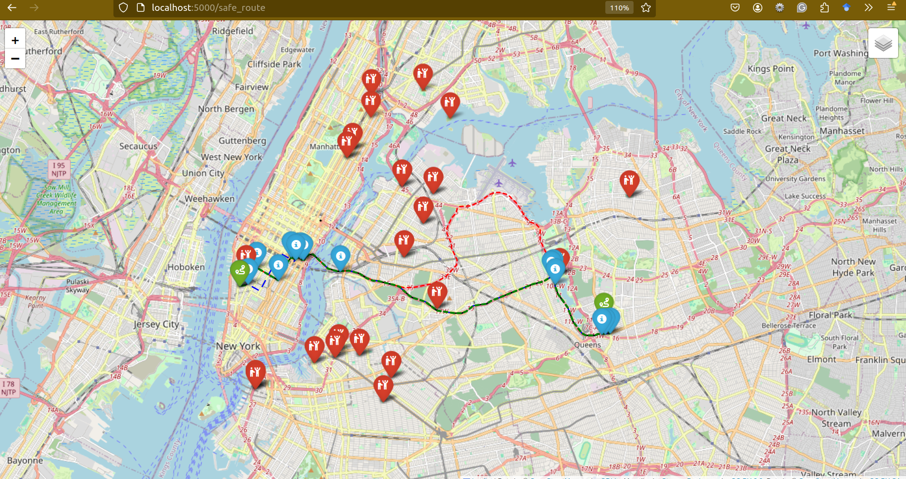
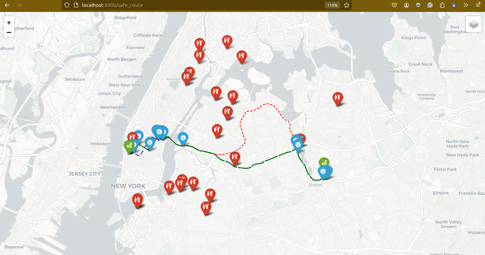

# Safe Route Application (openstreetmap)

## Overview

This application identifies and visualizes safe driving routes between two locations based on crime data. Using Google Maps API and a local dataset, it calculates crime probabilities along possible routes and plots the routes on an interactive map using the Folium library. The application is built with Flask for the web interface.





## Features

- **Route Selection**: Suggests alternative routes between two locations.
- **Crime Probability**: Calculates the likelihood of encountering crime based on historical data.
- **Interactive Map**: Displays routes on a map with crime markers at high-risk locations.
- **Multiple Map Layers**: Users can switch between different map views such as OpenStreetMap, Stamen Terrain, and others.
- **Route Directions**: Displays step-by-step directions with popup markers for visual guidance.

## Prerequisites

- Python 3.x
- Required Libraries:
  - `pandas`
  - `numpy`
  - `googlemaps`
  - `folium`
  - `Flask`
  - `polyline`

## Installation

1. **Clone the repository**:

   ```bash
   git clone https://github.com/your-repo/crime-mapping.git
   cd crime-mapping
   ```

2. **Install dependencies**:

   ```bash
   pip install -r requirements.txt
   ```

3. **Set up Google Maps API Key**:
   Replace the placeholder API key in `route.py` with your Google Maps API key:

   ```python
   gmaps = googlemaps.Client(key='YOUR_GOOGLE_MAPS_API_KEY')
   ```

4. **Add crime data**:
   Ensure you have a CSV file named `Updated_Crimes.csv` in the root of your project. This file should contain crime data with latitude, longitude, and crime type columns.

## Usage

1. **Start the Flask server**:

   ```bash
   python app.py
   ```

2. **Access the web interface**:
   Open a web browser and navigate to `http://localhost:5000/safe_route?source=<source_location>&destination=<destination_location>`, replacing `<source_location>` and `<destination_location>` with valid addresses.

3. **Interactive Map**:
   The map will display up to three routes with crime markers:

   - **Red Route**: Shortest route.
   - **Blue Route**: Alternative route.
   - **Black Route**: Another alternative with low risk.

   Crime markers will appear at locations along the routes where crimes have been reported.

## Files

- **route.py**: Contains the logic to fetch routes, calculate crime probability, and return top routes based on crime data.
- **draw_map.py**: Plots the selected routes on an interactive Folium map and adds markers for high-crime locations.
- **app.py**: Flask web server that serves the crime-mapped routes to users via an HTML interface.

## Example

You can test the application using a URL like this:

```bash
http://localhost:5000/safe_route?source=FREEDOM+SQUARE+PLAYGROUND,+NY&destination=BLEECKER+PLAYGROUND,+NY
```

This will calculate and display the safest routes between the two locations based on the crime data.
